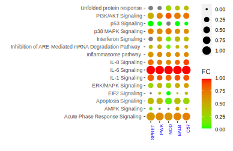
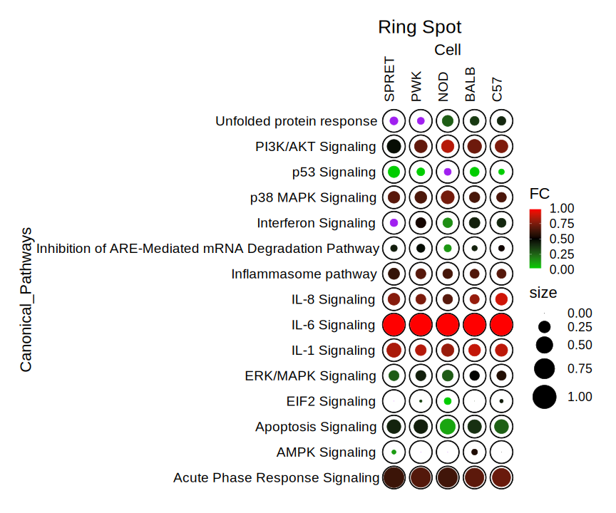

# 2D Spot plot ✳️

# 💻️ Read data 1.

```{r}
library(ggplot2)

data = read.csv("df1_sortedCanPath_pval.csv")
data

normalized<-function(y) {

  x<-y[!is.na(y)]

  x<-(x - min(x)) / (max(x) - min(x))

  y[!is.na(y)]<-x

  return(y)
  }
ncols = dim(data)[2]
ndata = apply(data[,c(2:ncols)],2,normalized)
# data
fcol = as.matrix(data[1])
data = as.data.frame(cbind(fcol, ndata))
write.csv(data, "df1_sortedCanPath_pval_normalized.csv", row.names = FALSE)
data
```
# 💻️ Read data 2.

```{r}
library(ggplot2)

data = read.csv("df2_sortedCanPath_FC.csv")
data

normalized<-function(y) {

  x<-y[!is.na(y)]

  x<-(x - min(x)) / (max(x) - min(x))

  y[!is.na(y)]<-x

  return(y)
  }
ncols = dim(data)[2]
ndata = apply(data[,c(2:ncols)],2,normalized)
# data
fcol = as.matrix(data[1])
data = as.data.frame(cbind(fcol, ndata))
write.csv(data, "df2_sortedCanPath_FC_normalized.csv", row.names = FALSE)
data
```

# 🥣️ Melt and merge the data frames.

```{r}
library(reshape)


#data = read.csv("Network_analysis_28_groups_normalized.csv")
#data
#long <- melt(data)
#long
#class(long)


data_radius = read.csv("df1_sortedCanPath_pval_normalized.csv")
data_radius
long_radius <- melt(data_radius, value.name = "P-value", variable.name = "Cell")
# Rename column where names is "Sepal.Length"
names(long_radius)[names(long_radius) == "variable"] <- "Cell"
names(long_radius)[names(long_radius) == "value"] <- "P_Value"
long_radius
class(long_radius)


data_col = read.csv("df2_sortedCanPath_FC_normalized.csv")
data_col
long_col <- melt(data_col)
# Rename column where names is "Sepal.Length"
names(long_col)[names(long_col) == "variable"] <- "Cell"
names(long_col)[names(long_col) == "value"] <- "FC"
long_col
class(long_col)

long = merge(long_radius, long_col, by=c("Canonical_Pathways","Cell"))
long
```
# 🖨️ Plot type I

```{r}
ggplot(long, aes(Cell, Canonical_Pathways, size = P_Value, colour = FC)) + 
  geom_point() + 
  scale_colour_gradient(low = "green", high = "red") +
  xlab("") +
  ylab("") +
   theme(
     axis.text.x = element_text(color = "blue", size = 8, angle = 90, hjust = 1),
        panel.grid.major = element_blank(), 
        panel.grid.minor = element_blank(),
        panel.background = element_rect(fill = "transparent",colour = NA),
        plot.background = element_rect(fill = "transparent",colour = NA)
        )

aspect_ratio <- 1
#height <- 15
ggsave("CanPath_spot1.png", height = 3.5 , width = 5.4 * aspect_ratio)
ggsave("CanPath_spot1.svg", height = 3.5 , width = 5.4 * aspect_ratio)

```



# 🖨️ Plot type II

```{r}
ggplot(long, aes(Cell, Canonical_Pathways, size = P_Value, colour = FC)) + 
  geom_point() + 
  #scale_colour_gradient(low = "red", high = "blue") +
  scale_colour_gradient2(low = "green", mid = "black", high = "red", midpoint = 0.5, na.value = "purple") +
  xlab("") +
  ylab("") +
   theme(
     axis.text.x = element_text(color = "blue", size = 8, angle = 90, hjust = 1),
        panel.grid.major = element_blank(), 
        panel.grid.minor = element_blank(),
        panel.background = element_rect(fill = "transparent",colour = NA),
        plot.background = element_rect(fill = "transparent",colour = NA)
        )

aspect_ratio <- 1
#height <- 15
ggsave("CanPath_spot_blue.png", height = 3.5 , width = 5.4 * aspect_ratio)
ggsave("CanPath_spot_blue.svg", height = 3.5 , width = 5.4 * aspect_ratio)
```


# 🖨️ Plot type II (Ring 💍️ spot ✳️)

```{r}
spot.theme <- list(
  theme_classic(),
  theme(axis.ticks.x=element_blank(), axis.text.x=element_text(size = 19, angle = 90, hjust = 0, color = "black")),
  theme(axis.ticks.y=element_blank(), axis.text.y=element_text(size = 19, color = "black")),
  theme(axis.line=element_blank()),
  theme(text = element_text(size = 22)),
  #theme(legend.position = "none"),
  theme(text = element_text(color = "black")),
  theme(plot.margin = unit(c(10,10,10,10), "mm")),
  scale_size_continuous(range = c(-0.3, 15)),
  scale_x_discrete(position = "top"))

colors <- pals::parula(10)[c(1,4,7,9)]

ring.spot   <- ggplot(long, aes(Cell, Canonical_Pathways)) + spot.theme + ggtitle("Ring Spot") +
                   scale_colour_gradient2(low = "green3", mid = "black", high = "red", midpoint = 0.5, na.value = "purple") +
                   geom_point(colour = "black",     aes(size = 1)) +
                   geom_point(colour = "white",     aes(size = 0.8)) +
                   #geom_point(colour = colors[[4]], aes(size = 0.81*P_Value))
                   geom_point(aes(colour = FC, size = 0.81*P_Value))
ring.spot

aspect_ratio <- 1
ggsave("CanPath_spot_outline.png", height = 10 , width = 12 * aspect_ratio)
ggsave("CanPath_spot_outline.svg", height = 10 , width = 12 * aspect_ratio)

```




